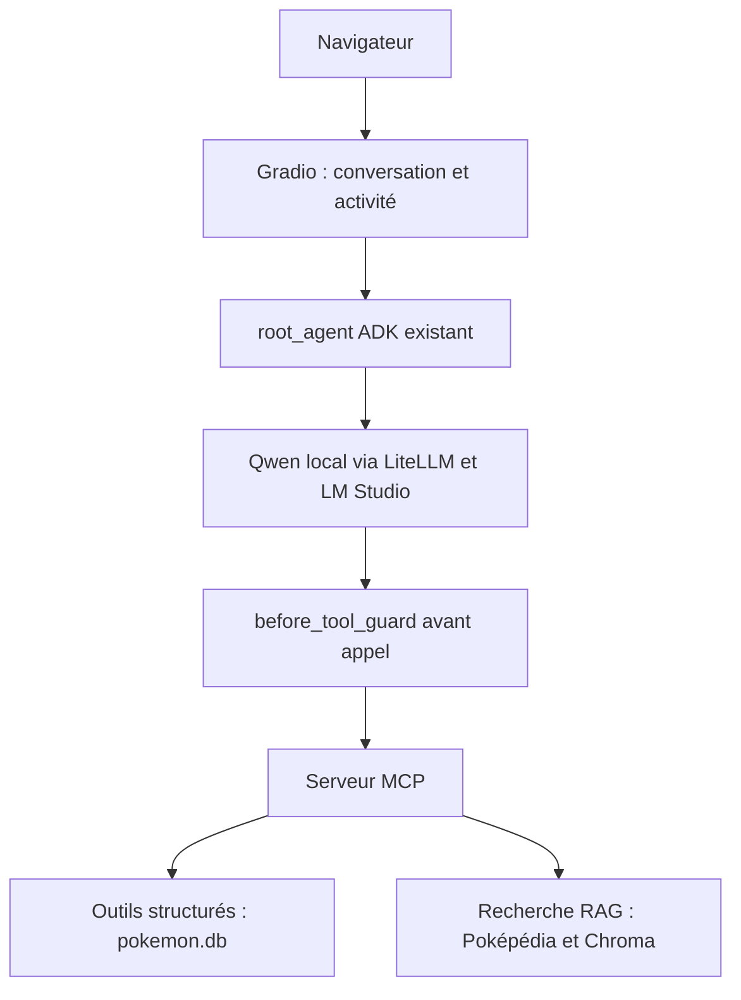
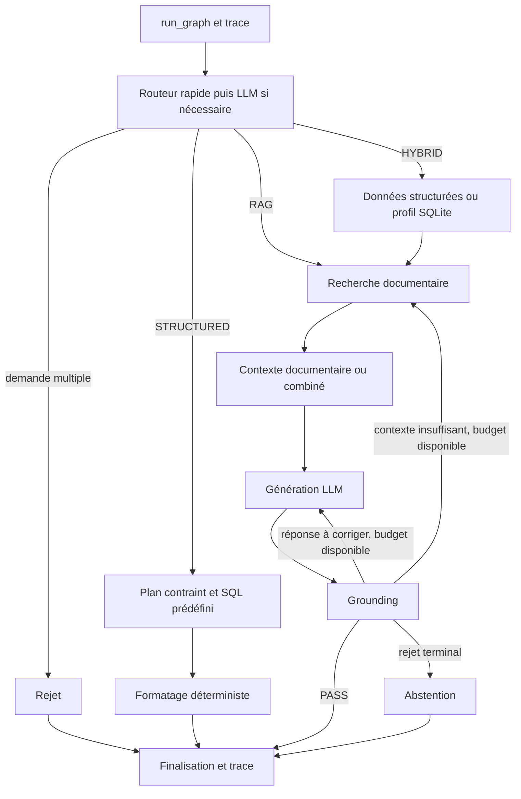

# Architecture et points de modification

Le code applicatif est dans `src/pokemon_rag`. Le graphe et le parcours MCP
partagent SQLite et la recherche documentaire, mais n'offrent pas les mêmes garanties.
Un agent ADK indépendant utilise Qwen local et expose les dix outils du serveur
via MCP, sans les contrôles du graphe ou du client MCP existant.
Le catalogue comprend désormais dix outils, dont une recherche Pokémon combinée
et un movepool filtrable ; les huit outils historiques gardent leur API.
La recherche compose aussi les filtres avec un classement SQL par statistique
de base ou total, un mode de superlatif avec ex aequo et une catégorie de formes
Méga. Le guard conserve ces arguments ; les calculs restent dans le moteur structuré.
Son callback déterministe préserve les niveaux, jeux et formes reconnus avant
l'appel d'outil ; ses limites sont décrites dans le [guide ADK](src/pokemon_rag/agent/README.md).
Lire ensuite uniquement le [guide spécialisé](docs/README.md) de la tâche.

## Points d'entrée

| Entrée | Usage et effets |
| --- | --- |
| `python -m pokemon_rag.web.app` | Interface Gradio, navigateur automatique, historique affiché et activité progressive ; session ADK indépendante par question |
| `adk run src/pokemon_rag/agent` | Agent ADK unique via LiteLLM et LM Studio ; dix outils MCP, guard avant appel, réponses en français, sans grounding |
| `python -m pokemon_rag.graph.graph` | Terminal interactif ; appelle `run_graph`, peut utiliser LM Studio et écrit une trace |
| `graph.graph.run_graph(initial_state)` | Entrée Python du graphe ; état contenant au minimum `question` |
| `python -m pokemon_rag.client.mcp_client` | Questions successives dans une session MCP, sélection d'un outil et réponse par Qwen |
| `python -m pokemon_rag.mcp.server` | Serveur stdio pour un client MCP ; ce n'est pas un terminal de questions-réponses |
| `scripts/batch/run_questions.py` | Lot de questions via le vrai graphe |
| `benchmarks/benchmark_*.py` | Évaluation des composants ou du graphe avec leurs dépendances réelles |

Ces commandes décrivent les entrées existantes, pas une autorisation d'exécution
par un agent. Les restrictions et prérequis sont dans [les tests](tests/README.md).
L'interface Gradio fournit un serveur Web local. Aucune commande n'est installée
via `[project.scripts]`.

## Parcours Web

La Web UI conserve l'historique à l'écran, sans le transmettre à ADK : chaque
question utilise une session temporaire distincte. Elle affiche les événements
d'outils ainsi que le temps écoulé. Elle conserve les limites du parcours ADK.
Voir le [guide Web](src/pokemon_rag/web/README.md) pour l'utilisation, les exemples
et les points non vérifiés concernant l'isolation des navigateurs.

## Parcours du graphe

Les flèches de reprise résument des nœuds dédiés : une nouvelle recherche et une
régénération ont chacune un budget d'une reprise. Les exceptions des nœuds protégés
suivent le chemin `processing_error`, puis la finalisation. Le détail des sorties
est dans le [contrat du graphe](src/pokemon_rag/graph/README.md).

`STRUCTURED` évite la génération et le grounding, mais son routage et son parsing
peuvent appeler le LLM. `HYBRID` utilise notamment le profil `custom_pokedex`
pour les présentations générales ; le tableur n'est pas lu à l'exécution.

## Parcours MCP

`client.mcp_client.open_client` démarre un sous-processus serveur, découvre les schémas
une fois et partage la session entre les questions. Pour chacune, le client
demande à Qwen un nom d'outil et des arguments, les réconcilie avec les contraintes
explicites, exécute l'outil autorisé puis demande à
Qwen une réponse. La fonction ponctuelle `ask` ouvre son propre contexte.
Le client sélectionne un seul outil par question : il n'orchestre pas
les trois routes du graphe et n'en applique pas le grounding, les reprises ou les traces.

Le serveur adapte les fonctions `get_*` et `retrieve` au protocole. Il ne passe
ni par `query_structured_data` ni par `run_graph`. Voir les
[limites du client et du serveur](src/pokemon_rag/mcp/README.md).

## Où implémenter un changement

| Comportement | Emplacement principal | Frontière à préserver |
| --- | --- | --- |
| Conversation Web, activité et exemples | `web/app.py`, `web/example_questions.txt` | Présentation et état de conversation ; réutiliser root_agent et MCP, sans dupliquer la logique métier |
| Configurer l'agent ADK et son modèle local | `agent/agent.py` | Couche indépendante, dix outils MCP structurés et documentaires ; voir le [guide ADK](src/pokemon_rag/agent/README.md) pour le contexte local et les limites |
| Préserver les contraintes avant un outil ADK | `agent/tool_guard.py` | Réutiliser les extracteurs communs ; restaurer les arguments compatibles ou bloquer l'appel ; aucun SQL ni calcul, catalogue/identité via le moteur existant |
| Choisir une route et identifier le Pokémon | `graph/router.py` | Ne pas y exécuter une requête métier ou générer la réponse finale |
| Extraire les formes, jeux et niveaux explicites | `constraints/query_constraints.py` | Extraction pure partagée entre moteur structuré et client MCP ; ni SQLite ni choix d'outil. Voir le [guide des contraintes](src/pokemon_rag/constraints/README.md) |
| Ajouter une opération structurée | `structured/query_engine.py` | Plan validé et SQL prédéfini, sans code LLM ; adapter aussi le parseur, le routeur, le formatage et éventuellement un outil MCP |
| Comprendre une question structurée, un jeu ou un niveau | `structured/query_parser.py` | Produit un plan, jamais du SQL ; seul module de `structured` qui appelle le LLM |
| Construire les contextes, profils, réponses et prompts de génération | `graph/nodes.py` | Le profil SQLite y est actuellement construit ; ne pas y ajouter le nettoyage wiki ou la construction d'index |
| Modifier transitions, budgets, erreurs terminales, finalisation | `graph/graph.py` | Ne pas cacher une politique de reprise dans le retrieval ou un outil MCP |
| Rechercher, fusionner, reranker, reconstruire une section | `rag/retrieval.py` | Retourner des passages ; ni réponse finale ni décision d'abstention |
| Vérifier fidélité et suffisance après génération | `rag/grounding.py` | Retourner un verdict ; le graphe décide de la suite |
| Ajouter une capacité MCP | `mcp/server.py` | Adapter le moteur existant, sans copier le SQL ou le retrieval |
| Choisir un outil et formuler sa réponse | `client/mcp_client.py` | Ne pas attribuer au client les garanties du graphe |
| Cumuler coûts et sérialiser les traces | `observability/metrics.py`, `observability/tracing.py` | Ne pas transformer une erreur d'écriture en échec métier |
| Changer les sources ou leur représentation indexée | `scripts/pokeapi/`, `scripts/pokepedia/` | Préparation explicite, jamais déclenchée par une requête applicative |

## Ressources et configuration

[config.py](src/pokemon_rag/config.py) définit les chemins de SQLite, du tableur,
du corpus et de Chroma, ainsi que les délais LLM utilisés par le graphe, le routeur,
le parseur et le grounding. Les noms de modèles et URL LM Studio restent déclarés
dans les modules appelants ; le client MCP a sa propre configuration.

`pokemon.db` réunit les données PokéAPI et le Pokédex personnalisé. Chroma stocke
les passages documentaires et leurs embeddings. Le retrieval charge les modèles,
le corpus en mémoire et BM25 au premier usage dans chaque processus. Les détails
de construction appartiennent au [guide des scripts](scripts/README.md), les coûts
au [guide de performance](docs/PERFORMANCE.md).

## Limites observées à examiner avant une évolution

- Les pannes du routeur arrêtent le graphe avant recherche ; `router_error` est
  conservé dans l'état et la trace. Le repli sémantique après une sortie valide
  est distingué des pannes dans le [contrat du graphe](src/pokemon_rag/graph/README.md).
- Le serveur MCP expose les fonctions sous-jacentes sans validation du plan complet.
  Le client réconcilie les contraintes reconnues avant exécution ; les limites
  d'extraction sont décrites dans le [guide des contraintes](src/pokemon_rag/constraints/README.md).
- Les dépendances sont déclarées dans `pyproject.toml` ; seules certaines versions
  sont fixées, sans verrouillage complet des dépendances transitives.
  La compatibilité du SDK MCP doit être vérifiée dans l'environnement installé.

Ce sont des constats sur le code, pas des changements applicatifs effectués par
la documentation. Les historiques `DEVELOPMENT*.md` décrivent des étapes anciennes
et ne constituent pas la spécification du comportement actuel.
