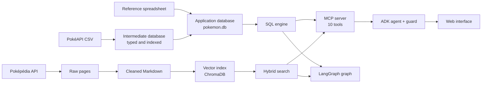

# Pokémon RAG

[](https://github.com/C-H-U-B/pokemon-rag/actions/workflows/ci.yml)

🇫🇷 [Version française](README_FR.md)

A complete data pipeline, from raw sources to a queryable service: two heterogeneous sources are collected, cleaned, modelled and validated, then exposed through a SQL engine and a document search to agents that answer in natural language with a local model.

Everything runs locally: SQLite, ChromaDB and an 8B Qwen model served by LM Studio.

## At a glance

| | |
| --- | --- |
| Sources | 24 PokéAPI CSV files, a hand-maintained reference spreadsheet, 1,216 Poképédia pages |
| Relational database | 30 tables, 51 indexes, 8 views; 638,000 move-learning rows across 32 game groups |
| Reference data | 1,025 species, 1,351 Pokémon, 1,579 forms, 937 moves |
| Document index | 36,280 embedded chunks |
| Tests | 906 tests, 822 of which need no model |
| End-to-end campaign | 31 of 31 questions passed with a local 8-billion-parameter model |

## Data flow



## The data pipeline

### Structured data: PokéAPI and the reference spreadsheet

| Step | Script | What it does |
| --- | --- | --- |
| Collection | `scripts/pokeapi/download_pokeapi.py` | Downloads the CSV files; a file already present is not downloaded again, and writes go through a temporary file |
| Intermediate database | `scripts/pokeapi/build_pokeapi_db.py` | Imports the CSV files with typed columns, creates indexes and label views |
| Application database | `scripts/pokeapi/build_pokemon_db.py` | Reads the spreadsheet, links each row to PokéAPI identifiers and builds the `custom_pokedex` view |

Matching the spreadsheet to PokéAPI is the delicate part: the two sources neither name nor split forms the same way. Each row gets a matching status, and forms without a match are reported rather than hidden.

### Document data: Poképédia

| Step | Script | What it does |
| --- | --- | --- |
| Collection | `scripts/pokepedia/download.py` | Queries the wiki API with a delay between requests; an interrupted run resumes without downloading again |
| Cleaning | `scripts/pokepedia/clean.py` | Converts wiki syntax to Markdown while keeping the section hierarchy |
| Indexing | `scripts/pokepedia/ingest.py` | Splits by section then by size, computes embeddings and loads ChromaDB with deterministic chunk identifiers |

Each chunk keeps the Pokémon, source file and section path it comes from, which lets the search rebuild a full section.

## Data quality

- **Checks at build time.** Each builder ends with a validation that stops the pipeline on an anomaly: database integrity, column types of the largest table, consistency of the matching between the French and English sheets, expected number of species.
- **Tests on real data.** Matching, default forms, evolutions and moves are checked against the built database.
- **Tests on a controlled catalogue.** The SQL logic is tested on small SQLite databases created for each test, with adversarial cases: out-of-order identifiers, null values, ties, missing forms.
- **Isolation.** Light tests fail if they open the project databases or load a model. The SQL engine imports no model client, which a test verifies.
- **Continuous integration.** On every push, GitHub Actions installs the project on a clean machine, runs the static checks and the 682 tests that depend on neither local data nor a model.

One data anomaly met along the way shows why these checks matter: the most recent game uses a single learning method, so a search for moves by level returned an empty list for more than 300 Pokémon. Game selection now takes the requested method into account.

## Serving the data

- **SQL engine.** Parameterised functions cover evolutions, moves, types, multi-criteria search and rankings by statistic. Filters, sorts, totals and ties are computed in SQL. The language model never writes SQL: it picks an operation and its arguments.
- **Document search.** Combined lexical and vector search, awareness of section structure, then reranking.
- **MCP server.** Ten tools expose these functions to any compatible client.

Three ways of answering a question rely on the same data:

| Path | Principle | Guarantees |
| --- | --- | --- |
| LangGraph graph | Routes between SQL, document search or both | Constrained plan, answer faithfulness check, bounded retries, abstention, traces |
| MCP client | Minimal hand-written agent loop | Explicit constraints of the question preserved |
| ADK agent and web interface | The model picks the tools, a deterministic check verifies each call | Arguments corrected or call refused, measured context budget |

## Making a small model reliable

An 8-billion-parameter model often gets arguments wrong: it forgets a filter, invents a bound, replaces a rare name with a more common one. Rather than trusting it, a deterministic check extracts the constraints from the question and compares them with the proposed call before it runs.

Results of the 31-question campaign, before and after the latest reliability work:

| Measure | Before | After |
| --- | --- | --- |
| Questions passed | 24 | 31 |
| Calls correct as proposed by the model | 15 | 30 |
| Answers dropped for exceeding the context budget | 5 | 0 |

Each cause was isolated before being fixed, telling data errors, test errors and orchestration errors apart. The full account is in the [development history](DEVELOPMENT.md).

## Stack

Python, SQLite, ChromaDB, Sentence Transformers, BM25, CrossEncoder reranking, LangGraph, Google ADK, Model Context Protocol, Gradio, LM Studio, pytest, ruff.

## Running the project

Requirements: Python 3.10 or later, and LM Studio with `qwen/qwen3-vl-8b` (16,384-token context window) for the paths that call a model.

```bash
pip install -e .
```

Build the data (read [the scripts guide](scripts/README.md), in French, before rebuilding: it replaces existing resources):

```bash
python scripts/pokeapi/download_pokeapi.py
python scripts/pokeapi/build_pokeapi_db.py
python scripts/pokeapi/build_pokemon_db.py
python scripts/pokepedia/download.py
python scripts/pokepedia/clean.py
python scripts/pokepedia/ingest.py
```

Web interface, then the command-line graph:

```bash
python -m pokemon_rag.web.app
python -m pokemon_rag.graph.graph
```

Tests without a model or local data, and static checks:

```bash
python -m pytest -m "not real_data and not llm and not models"
ruff check .
```

## Known limits

- The databases and corpus are not versioned: they must be rebuilt to run the project.
- Build steps are launched by hand, in the order above, and rebuild everything.
- Continuous integration does not cover the tests that need the built databases or a model (224 of 906).
- End-to-end measurements depend on a local model; they are rerun manually.

## Documentation

Contributor guides are written in French.

- [Architecture](ARCHITECTURE.md): flows, entry points and module boundaries.
- [Scripts and data](scripts/README.md): preparation pipelines.
- [Structured engine](src/pokemon_rag/structured/README.md), [document search](src/pokemon_rag/rag/README.md), [MCP server](src/pokemon_rag/mcp/README.md), [ADK agent](src/pokemon_rag/agent/README.md).
- [Tests](tests/README.md): which validation to run for a given change.
- [Development history](DEVELOPMENT.md): decisions, problems met and fixes, in chronological order.
