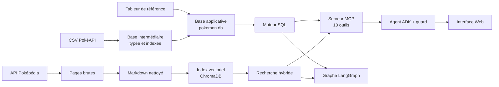

# Pokémon RAG

🇬🇧 [English version](README.md)

Une chaîne de données complète, de la source brute au service interrogeable : deux sources hétérogènes sont collectées, nettoyées, modélisées et contrôlées, puis exposées par un moteur SQL et une recherche documentaire à des agents qui répondent en langage naturel avec un modèle local.

Le projet tourne entièrement en local : SQLite, ChromaDB et un modèle Qwen 8B servi par LM Studio.

## En bref

| | |
| --- | --- |
| Sources | 24 fichiers CSV PokéAPI, un tableur de référence maintenu à la main, 1 216 pages Poképédia |
| Base relationnelle | 30 tables, 51 index, 8 vues ; 638 000 lignes d'apprentissage de capacités sur 32 groupes de jeux |
| Référentiel | 1 025 espèces, 1 351 Pokémon, 1 579 formes, 937 capacités |
| Index documentaire | 36 280 fragments vectorisés |
| Tests | 906 tests, dont 822 sans aucun modèle |
| Campagne de bout en bout | 31 questions sur 31 réussies avec un modèle local de 8 milliards de paramètres |

## Flux de données



## La chaîne de données

### Données structurées : PokéAPI et tableur de référence

| Étape | Script | Ce qu'elle fait |
| --- | --- | --- |
| Collecte | `scripts/pokeapi/download_pokeapi.py` | Télécharge les CSV ; un fichier déjà présent n'est pas retéléchargé, et l'écriture passe par un fichier temporaire |
| Base intermédiaire | `scripts/pokeapi/build_pokeapi_db.py` | Importe les CSV avec des colonnes typées, crée les index et les vues de libellés |
| Base applicative | `scripts/pokeapi/build_pokemon_db.py` | Lit le tableur, relie chaque ligne aux identifiants PokéAPI et produit la vue `custom_pokedex` |

Le rapprochement entre le tableur et PokéAPI est le point délicat : les deux sources ne nomment ni ne découpent les formes de la même façon. Chaque ligne reçoit un statut de rapprochement, et les formes sans correspondance sont signalées plutôt que masquées.

### Données documentaires : Poképédia

| Étape | Script | Ce qu'elle fait |
| --- | --- | --- |
| Collecte | `scripts/pokepedia/download.py` | Interroge l'API du wiki avec un délai entre les requêtes ; une exécution interrompue reprend sans retélécharger |
| Nettoyage | `scripts/pokepedia/clean.py` | Convertit la syntaxe wiki en Markdown en conservant la hiérarchie des sections |
| Indexation | `scripts/pokepedia/ingest.py` | Découpe par section puis par taille, calcule les embeddings et alimente ChromaDB avec des identifiants de fragments déterministes |

Chaque fragment garde le Pokémon, le fichier source et le chemin de section dont il provient, ce qui permet de reconstruire une section complète au moment de la recherche.

## Qualité des données

- **Contrôles à la construction.** Chaque constructeur se termine par une validation qui interrompt la chaîne en cas d'anomalie : intégrité de la base, typage des colonnes de la plus grosse table, cohérence du rapprochement entre les feuilles française et anglaise, nombre d'espèces attendu.
- **Tests sur les données réelles.** Le rapprochement, les formes par défaut, les évolutions et les capacités sont vérifiés sur la base construite.
- **Tests sur catalogue contrôlé.** La logique SQL est testée sur de petites bases SQLite créées pour chaque test, avec des cas adverses : identifiants dans le désordre, valeurs nulles, égalités, formes manquantes.
- **Isolation.** Les tests légers échouent s'ils ouvrent les bases du projet ou chargent un modèle. Le moteur SQL n'importe aucun client de modèle, ce qu'un test vérifie.

Une anomalie de données rencontrée en cours de route illustre l'intérêt de ces contrôles : le jeu le plus récent n'utilise qu'une seule méthode d'apprentissage, si bien qu'une recherche de capacités par niveau y renvoyait une liste vide pour plus de 300 Pokémon. La sélection du jeu tient désormais compte de la méthode demandée.

## Exposer les données

- **Moteur SQL.** Des fonctions paramétrées couvrent les évolutions, les capacités, les types, la recherche multicritère et les classements par statistique. Les filtres, les tris, les totaux et les égalités sont calculés en SQL. Le modèle de langage ne produit jamais de SQL : il choisit une opération et ses arguments.
- **Recherche documentaire.** Recherche lexicale et vectorielle combinées, prise en compte de la structure des sections, puis reclassement.
- **Serveur MCP.** Dix outils exposent ces fonctions à n'importe quel client compatible.

Trois façons de répondre à une question s'appuient sur ces mêmes données :

| Parcours | Principe | Garanties |
| --- | --- | --- |
| Graphe LangGraph | Routage entre SQL, recherche documentaire ou les deux | Plan contraint, contrôle de fidélité de la réponse, reprises bornées, abstention, traces |
| Client MCP | Boucle d'agent minimale écrite à la main | Contraintes explicites de la question préservées |
| Agent ADK et interface Web | Le modèle choisit les outils, un contrôle déterministe vérifie chaque appel | Arguments corrigés ou appel refusé, budget de contexte mesuré |

## Fiabiliser un petit modèle

Un modèle de 8 milliards de paramètres se trompe souvent sur les arguments : il oublie un filtre, invente une borne, remplace un nom rare par un nom plus courant. Plutôt que de lui faire confiance, un contrôle déterministe extrait les contraintes de la question et les compare à l'appel proposé avant son exécution.

Résultats de la campagne de 31 questions, avant et après les derniers travaux de fiabilité :

| Mesure | Avant | Après |
| --- | --- | --- |
| Questions réussies | 24 | 31 |
| Appels corrects dès la proposition du modèle | 15 | 30 |
| Réponses abandonnées pour dépassement de contexte | 5 | 0 |

Chaque cause a été isolée avant d'être corrigée, en distinguant erreur de données, erreur de test et erreur d'orchestration. Le récit complet est dans [l'historique de développement](DEVELOPMENT_FR.md).

## Technologies

Python, SQLite, ChromaDB, Sentence Transformers, BM25, reclassement par CrossEncoder, LangGraph, Google ADK, Model Context Protocol, Gradio, LM Studio, pytest, ruff.

## Lancer le projet

Prérequis : Python 3.10 ou plus récent, et LM Studio avec `qwen/qwen3-vl-8b` (fenêtre de contexte de 16 384 tokens) pour les parcours qui appellent un modèle.

```bash
pip install -e .
```

Construire les données (voir [le guide des scripts](scripts/README.md) avant de relancer une construction, qui remplace les ressources existantes) :

```bash
python scripts/pokeapi/download_pokeapi.py
python scripts/pokeapi/build_pokeapi_db.py
python scripts/pokeapi/build_pokemon_db.py
python scripts/pokepedia/download.py
python scripts/pokepedia/clean.py
python scripts/pokepedia/ingest.py
```

Interface Web, puis graphe en ligne de commande :

```bash
python -m pokemon_rag.web.app
python -m pokemon_rag.graph.graph
```

Tests sans modèle ni données locales, et contrôle statique :

```bash
python -m pytest -m "not real_data and not llm and not models"
ruff check .
```

## Limites connues

- Les bases et le corpus ne sont pas versionnés : il faut les reconstruire pour faire tourner le projet.
- Les étapes de construction se lancent à la main, dans l'ordre ci-dessus, et reconstruisent tout.
- Aucune intégration continue n'est encore en place.
- Les mesures de bout en bout dépendent d'un modèle local ; elles sont relancées manuellement.

## Documentation

- [Architecture](ARCHITECTURE.md) : flux, points d'entrée et frontières entre modules.
- [Scripts et données](scripts/README.md) : chaînes de préparation.
- [Moteur structuré](src/pokemon_rag/structured/README.md), [recherche documentaire](src/pokemon_rag/rag/README.md), [serveur MCP](src/pokemon_rag/mcp/README.md), [agent ADK](src/pokemon_rag/agent/README.md).
- [Tests](tests/README.md) : quelle validation lancer selon la modification.
- [Historique de développement](DEVELOPMENT_FR.md) : décisions, problèmes rencontrés et corrections, dans l'ordre chronologique.
